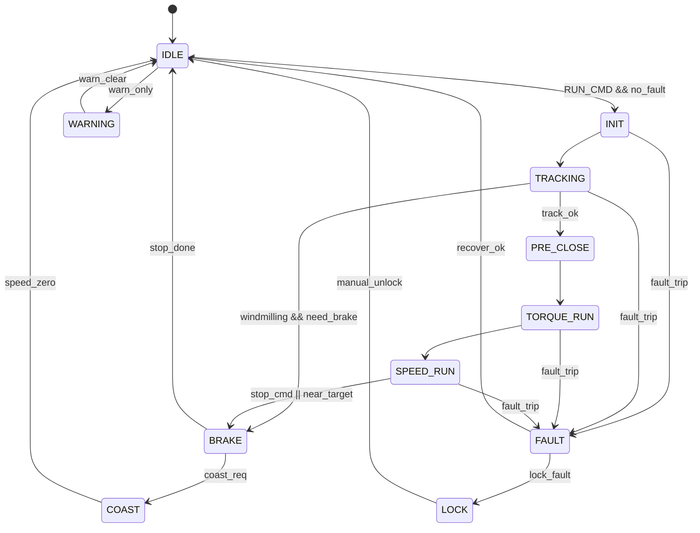
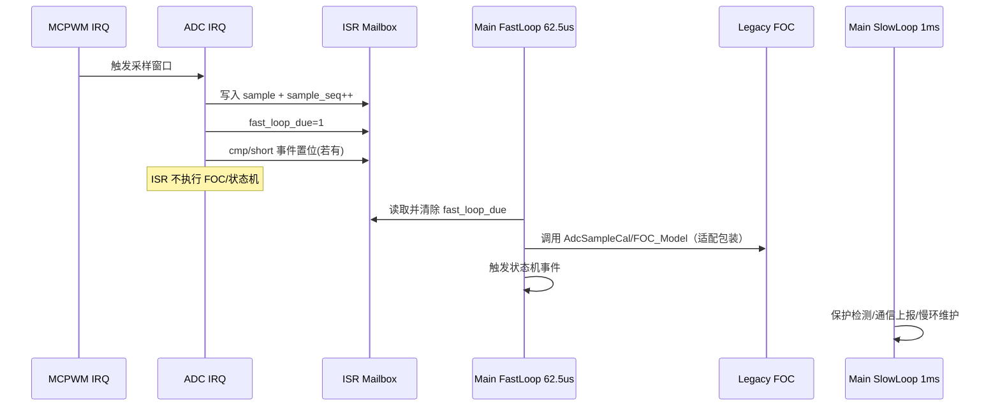
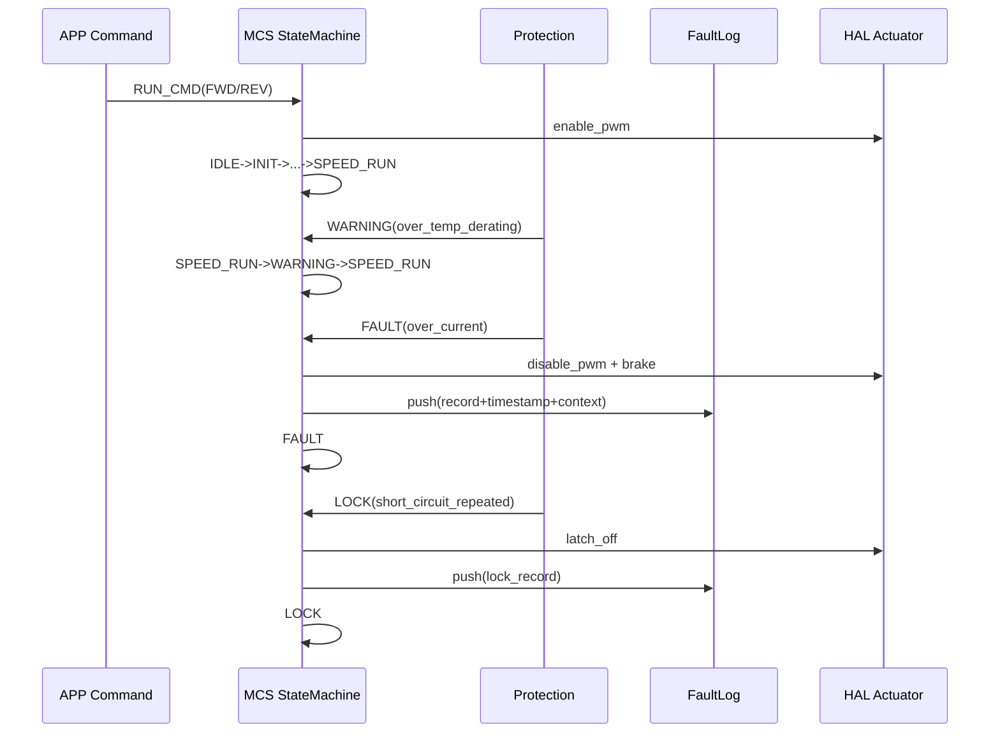

# LKS32MC03x FOC 架构重构蓝图（不改算法内核）

本蓝图满足以下约束：
- 保持现有 FOC 算法逻辑不变（通过适配层调用现有函数）。
- 兼容现有通信协议接口（manage.c / Uart.c）。
- 不使用动态内存（malloc/free）。
- 保留现有保护阈值参数值不变（欠压/过压/过流/堵转等）。
- 支持多电机扩展（当前 1 路，目标 3-4 路）。

## 1) 目录结构（树状图）

```text
architecture_refactor/
  README_ARCHITECTURE.md
  include/
    bsp/
      bsp_lks32mc03x_if.h
    hal/
      hal_motor_if.h
    mcs/
      mcs_types.h
      mcs_error.h
      mcs_state_machine.h
      mcs_control.h
    app/
      app_motor_if.h
```

分层依赖仅允许：

```text
APP -> MCS -> HAL -> BSP
```

## 2) 各层头文件接口（完整 C 定义，只接口不实现）

接口文件如下：
- `include/bsp/bsp_lks32mc03x_if.h`
- `include/hal/hal_motor_if.h`
- `include/mcs/mcs_types.h`
- `include/mcs/mcs_error.h`
- `include/mcs/mcs_state_machine.h`
- `include/mcs/mcs_control.h`
- `include/app/app_motor_if.h`

接口约束要点：
- ISR 仅采样 + 置标志（mailbox）。
- 主循环 62.5us 快环执行控制算法。
- config/status 分离。
- 单电机句柄独立，可并行扩展为多实例。

## 3) 核心数据结构

关键结构体：
- `Motor_HandleTypeDef`
- `MCS_Instance_t`
- `MCS_MotorConfig_t`
- `MCS_MotorStatus_t`
- `MCS_IsrMailbox_t`
- `MCS_FaultRecord_t`

设计原则：
- `config`：启动后基本不变的配置（阈值、方向、步进、周期）。
- `status`：运行时状态（状态机、反馈量、故障、时间戳）。
- `mailbox`：ISR 与主循环唯一共享通道，字段使用 `volatile`。

## 4) 统一状态机（覆盖 FOC 全状态）

状态集合：
`IDLE/INIT/TRACKING/ALIGN/OPEN_LOOP/PRE_CLOSE/TORQUE_RUN/SPEED_RUN/BRAKE/COAST/WARNING/FAULT/LOCK`

说明：
- `COAST`：显式滑行态（关驱动不刹车）。
- `WARNING`：降额运行，不立即停机。
- `FAULT`：故障停机，满足条件可恢复。
- `LOCK`：锁死故障，需人工解锁。



## 5) 错误码体系（分层错误码 + 级联上报）

`mcs_error.h` 中定义了 32 位统一错误码：
- `Level`：WARNING / FAULT / LOCK
- `Source`：BSP / HAL / MCS / APP
- `Category`：电源/热/机械/通信/状态机/配置
- `Detail`：过流、欠压、堵转等细分错误

并提供：
- `MCS_FaultRecord_t`：带时间戳和上下文字段（电流/电压/速度/状态）。
- `MCS_FaultLog_t`：环形故障记录缓存。
- `MCS_ProtectionEvaluate()`：可单元测试的保护判定接口。

## 6) 关键时序图

### 6.1 ISR 与主循环交互（62.5us）



### 6.2 状态转换与故障分级时序



## 迁移建议（最小风险）

1. 先迁移 `ADC_IRQHandler`：仅保留采样 + 置位，FOC 下放主循环快环。  
2. 再拆分控制调用：从 `McRoutineTask()` 迁移为 `MCS_FastLoop_62p5us()` + `MCS_SlowLoop_1ms()`。  
3. 最后替换全局变量：将 `gMainStatus/gMotorMainCmd/gMotorFuncPar` 映射到每电机句柄。  

## BSP 替换层落地
- 头文件：[bsp_lks32mc03x_if.h](include/bsp/bsp_lks32mc03x_if.h)
- 源文件：`src/bsp/bsp_lks32mc03x_if.c`
- 说明文档：[BSP_LAYER_REPLACE.md](BSP_LAYER_REPLACE.md)

## 代码风格

统一编码、注释、命名、调试宏和分层边界说明见：[CODING_STYLE.md](CODING_STYLE.md)。
